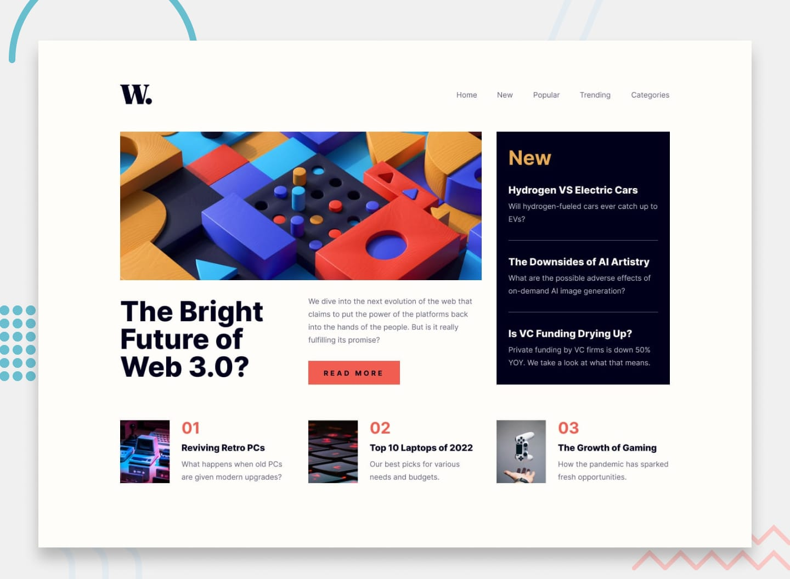

# Frontend Mentor — Рішення для домашньої сторінки новин

Це моє рішення для челенджу [News homepage challenge on Frontend Mentor](https://www.frontendmentor.io/challenges/news-homepage-H6SWTa1MFl). Завдання від Frontend Mentor допомагають розвивати навички верстки та створення інтерфейсів, наближених до реальних проєктів.

## Зміст

- [Frontend Mentor — Рішення для домашньої сторінки новин](#frontend-mentor--рішення-для-домашньої-сторінки-новин)
  - [Зміст](#зміст)
  - [Огляд](#огляд)
    - [Завдання](#завдання)
    - [Скріншот](#скріншот)
    - [Посилання](#посилання)
  - [Мій підхід](#мій-підхід)
    - [Використані технології](#використані-технології)
    - [Що я вивчив](#що-я-вивчив)
    - [Корисні ресурси](#корисні-ресурси)
  - [Автор](#автор)
  - [Подяки](#подяки)

## Огляд

### Завдання

Користувачі повинні мати змогу:

- Переглядати оптимальне компонування інтерфейсу на різних пристроях
- Бачити стани наведення та фокусу для всіх інтерактивних елементів

### Скріншот



### Посилання

- [Рішення URL:](https://github.com/stoneandre/news-homepage)
- [Живий сайт URL:](https://stoneandre.github.io/news-homepage/)

## Мій підхід

### Використані технології

- Семантична HTML5-розмітка
- Flexbox

### Що я вивчив

За допомогою ментора вперше працював з DOM

```js
const nav = document.querySelector('nav')
    const button = document.querySelector('header button')
    console.dir(nav);
    console.dir(button);

    button.addEventListener('click', function () {
      // console.log('на мене клікнули');
      if (nav.style.display === 'block') {
        nav.style.display = 'none'
        document.body.style.overflow = ''
      } else {
        nav.style.display = 'block'
        document.body.style.overflow = 'hidden'
      }

    })
```

### Корисні ресурси

- [MDN-HTML](https://developer.mozilla.org/en-US/docs/Web/HTML)
- [MDN-CSS](https://developer.mozilla.org/en-US/docs/Web/CSS)
- [MDN-JS](https://developer.mozilla.org/en-US/docs/Web/JavaScript)

## Автор

- Мій профіль на Frontend Mentor - [@stoneandre](https://www.frontendmentor.io/profile/stoneandre)

## Подяки

Дякую ментору який мені допомагає вивчати HTML, CSS, JS.
